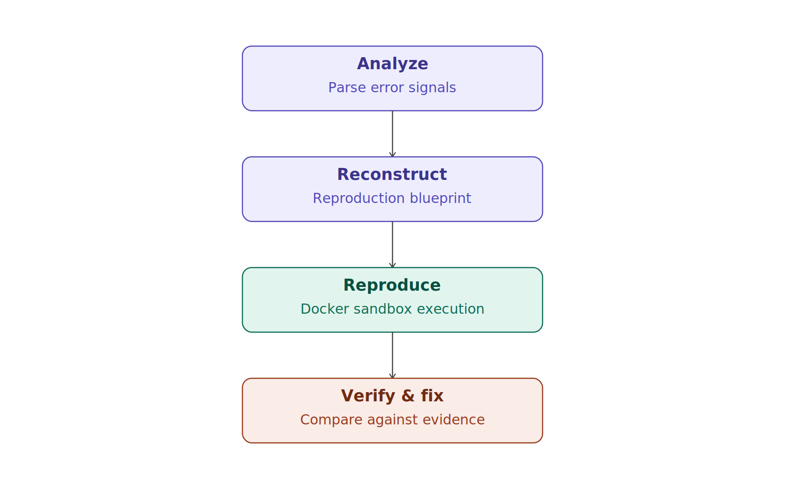
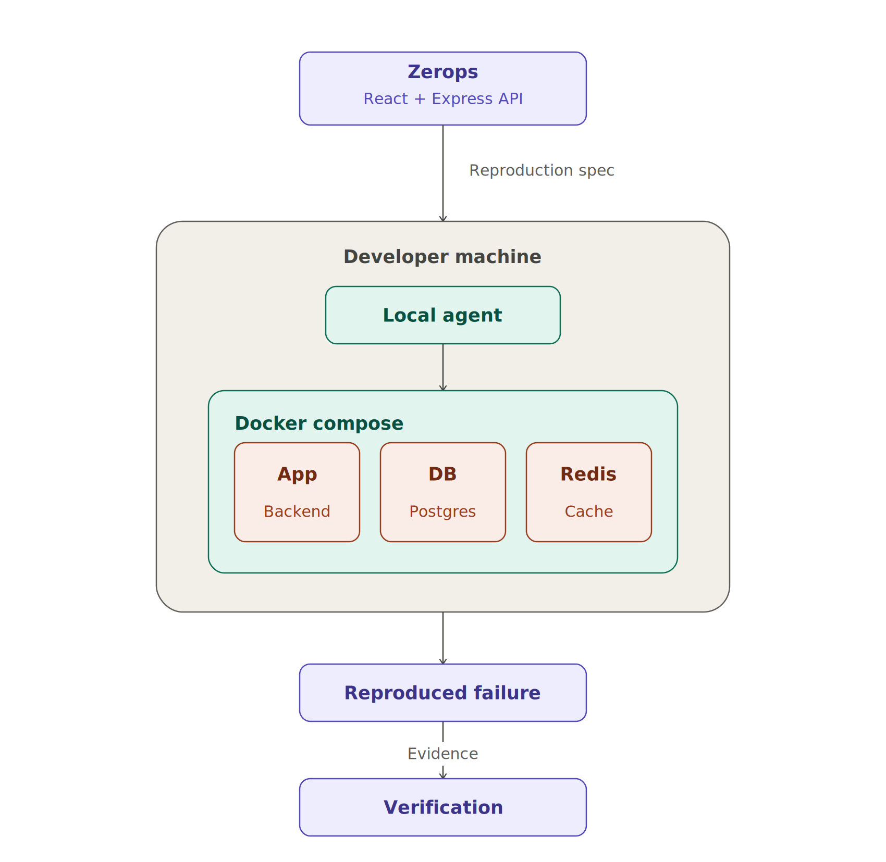
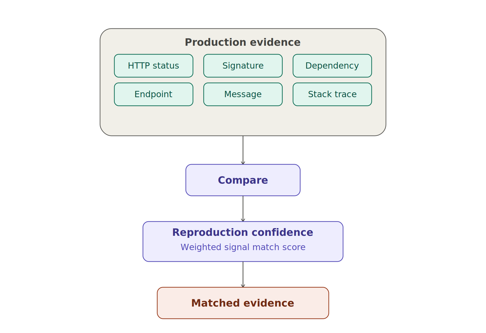
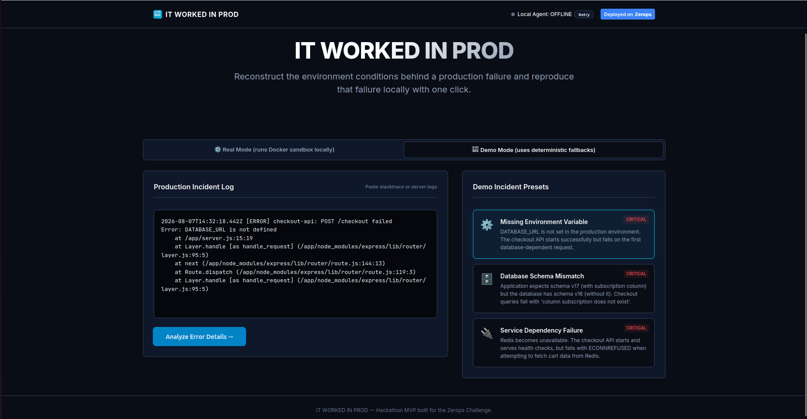
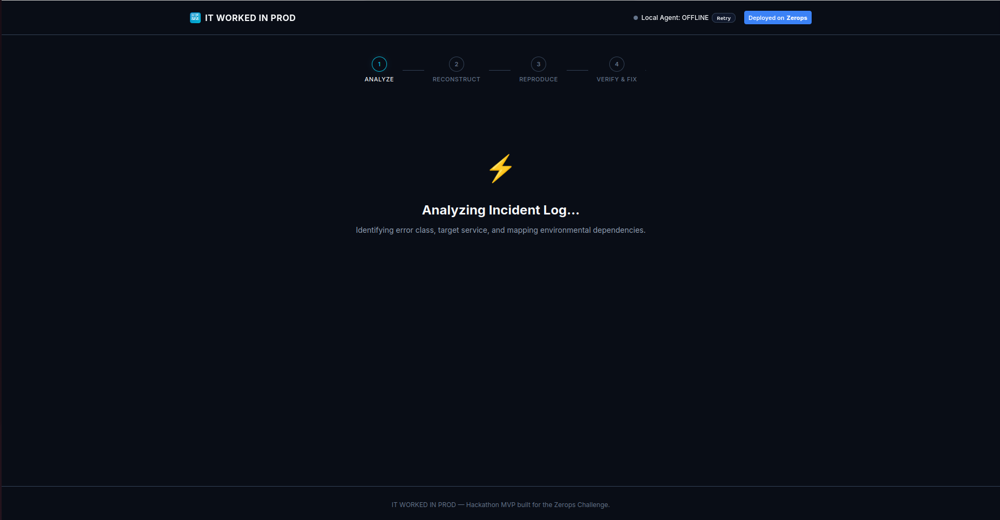
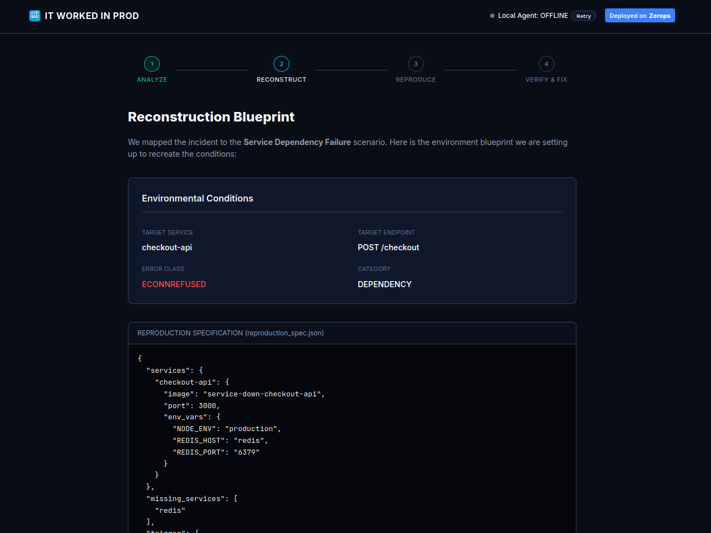
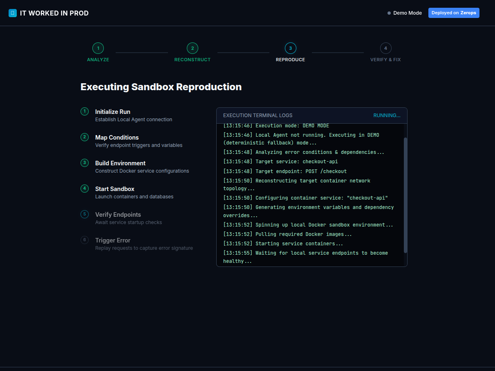
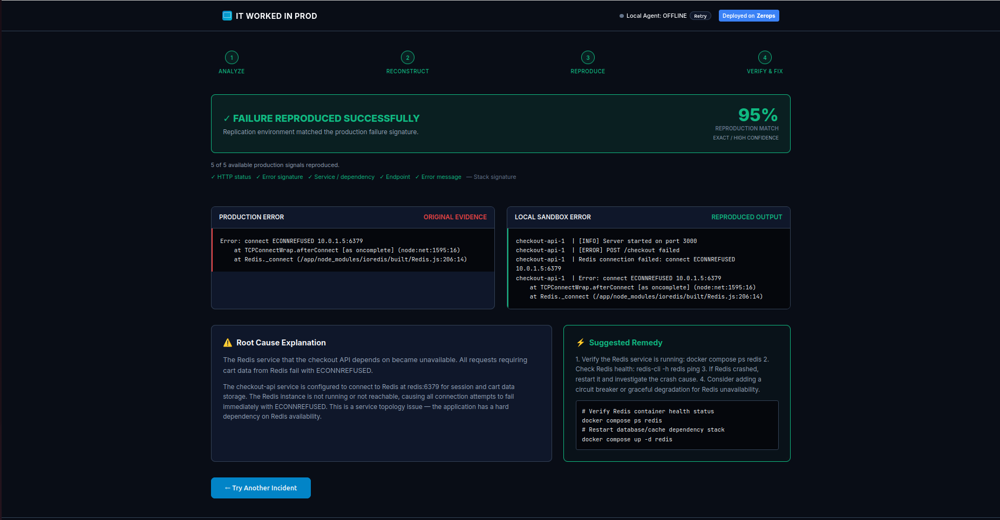

# IT WORKED IN PROD

> **Reproduce production bugs locally with one click.**

[🚀 Live Demo](https://app-2c53-3001.prg1.zerops.app/) · [🎥 Demo Video](https://youtu.be/qY2tWO_cmZ8)

**IT WORKED IN PROD** turns a production failure into a reproducible local incident.

Paste a production error, reconstruct the failure scenario, run it inside an isolated Docker sandbox, and compare the reproduced failure against the original production evidence.

Instead of asking:

> *"What went wrong?"*

the goal is:

> **"Can I reproduce it?"**

---

## How It Works



> **Note:** The hosted demo runs in Demo Mode because the Docker reproduction agent runs locally on the developer's machine. Real Mode connects the web application to the Local Agent on `localhost:4317` to execute the Docker sandbox.

The system is split into two parts:

* **Zerops-hosted web application**
  React frontend + Express backend for incident analysis, reconstruction, and verification.

* **Local reproduction agent**
  A Node.js agent running on the developer's machine that controls Docker Compose, executes the reproduction scenario, and captures the resulting failure.

This keeps the web application publicly accessible while allowing the reproduction environment to run directly against the developer's Docker engine.

---

## Architecture



Zerops hosts the application and analysis layer. The Local Agent executes the actual Docker-based reproduction locally.

---

## Reproduction Scenarios

The current MVP supports three deterministic production-style failures:

| Scenario                       | Reproduction                                            |
| ------------------------------ | ------------------------------------------------------- |
| **Missing configuration**      | Runs the application without `DATABASE_URL`             |
| **Database schema mismatch**   | Runs the application against an older PostgreSQL schema |
| **Service dependency failure** | Reproduces an unavailable Redis dependency              |

Each scenario runs as an actual containerized environment and produces real runtime output.

---

## Verification

The reproduced failure is compared against the original production evidence using multiple signals:

* HTTP status
* Error signature
* Service / dependency
* Endpoint
* Error message
* Stack signature

The result includes a **reproduction confidence score** and the signals that matched.



The goal is not simply to detect a similar error, but to provide evidence that the local failure corresponds to the production incident.

---

## Screenshots

### Homepage


### Analyze



### Reconstruct



### Reproduce



### Verify



---

## Tech Stack

* **Frontend:** React, Vite
* **Backend:** Node.js, Express
* **AI:** Gemini
* **Reproduction:** Docker, Docker Compose
* **Deployment:** Zerops

---

## Running Locally

### Requirements

* Node.js 20+
* Docker
* Docker Compose

### Setup

```bash
git clone https://github.com/Darshith-845/ItWorkedInProd.git
cd IT-WORKED-IN-PROD

npm install
npm run install:agent
npm run build
```

Start the web application:

```bash
npm start
```

Start the local reproduction agent:

```bash
npm run agent
```

The web application runs on:

```text
http://localhost:3001
```

The Local Agent runs on:

```text
http://localhost:4317
```

### Environment Variables

If using Gemini analysis, configure:

```env
GEMINI_API_KEY=your_api_key
```


---

## Why Zerops?

Zerops provides the public deployment environment for the application.

The architecture deliberately separates the hosted application from local infrastructure execution:

See the [Architecture](#architecture) diagram above for how the cloud and local layers separate.

This allows the application to remain publicly accessible while the reproduction environment retains direct access to Docker on the developer's machine.

The Zerops deployment is defined through `zerops.yml`.

---

## Project Structure

```text
IT-WORKED-IN-PROD/
│
├── client/              # React frontend
├── local-agent/         # Local Docker orchestration agent
├── scenarios/           # Reproduction environments
│   ├── missing-config/
│   ├── db-schema/
│   └── service-down/
│
├── api.js               # Backend API
├── ai.js                # Incident analysis
├── index.js             # Express server
├── zerops.yml           # Zerops deployment configuration
├── PROJECT_CONTEXT.md
├── package.json
└── README.md
```

---

## Limitations

The current MVP focuses on three deterministic incident scenarios:

1. Missing configuration
2. Database schema mismatch
3. Service dependency failure

It is **not yet a general-purpose production environment reconstruction system**.

The current implementation demonstrates the complete workflow:

---

## Future Work

* More infrastructure and incident scenarios
* Automatic environment reconstruction
* Kubernetes and cloud dependency reproduction
* CI/CD integration
* Incident history and regression testing

---

## Built for the Zerops Challenge

Production failures are difficult to debug because the environment in which they occurred may no longer exist.

**IT WORKED IN PROD** explores a simple alternative:

```text
Don't just analyze the failure.

Recreate it.
Run it.
Compare it.
Prove it.
```

---

## License

This project was built as a hackathon project for **The Zerops Challenge**.
But created Apache License when making the repo 